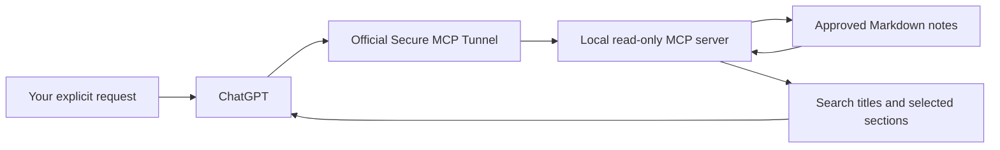

# Mio Memory

**Your notes stay yours. Your AI can look up what you ask it to remember.**

[中文说明](README.zh-CN.md) · [Use in ChatGPT](docs/CHATGPT_USAGE.md#english) · [Architecture](docs/ARCHITECTURE.md) · [Privacy](docs/PRIVACY.md) · [Known issues](docs/KNOWN_ISSUES.md)

Mio Memory combines a portable Markdown memory library with a small, read-only MCP server. Keep stable facts, everyday moments, and their sources in ordinary files. When you ask, an AI searches locally, reads the relevant sections, and answers with file names, line numbers, dates, and uncertainty intact.

This repository shares the **architecture, code, and fictional examples**. It contains no author's private memories. Obsidian is optional; Markdown is the storage format.

## Use your memory in ChatGPT

**After setup, you can retrieve local notes from an ordinary ChatGPT conversation.** The author has successfully used `search` and `fetch` in the **ChatGPT Mac app**. Your agent installs the bridge; everyday lookups happen in ChatGPT, without returning to Codex for each one. Available menus depend on your account and client version.

With the local service and private tunnel running and reads enabled, open a ChatGPT conversation and use the input box's **＋ → Apps / Developer mode** entry to select **Mio Memory Read-only** (or your chosen app name). For the included fictional sample vault, try:

> Please actually call Mio Memory Read-only: first use search for “小禾 Python”, then use fetch to read the relevant result. Distinguish current and historical records, and cite the file and line numbers. If you did not call the tools, say so rather than answering from memory.

“小禾” is a fictional test character. Check the tool activity for an actual **search → fetch** sequence. A GitHub link alone does not connect ChatGPT to your computer. [Follow the ChatGPT setup and daily-use guide →](docs/CHATGPT_USAGE.md#english)

## Give it to your agent

You should not have to become a systems administrator to try your own memory library. Download or clone this repository, give its folder or GitHub URL to an agent that can work on your computer, and send:

> Please install Mio Memory for me. Read AGENTS.md and docs/AGENT_INSTALL.md first. Use an isolated Python environment and start with the fictional sample vault, with reading locked by default. Verify it locally before connecting my ChatGPT account. Ask me which real notes I want to expose and whether I want a timed read window or manual start/stop. Keep the service read-only, bind it to localhost, and use an official Secure MCP Tunnel if available for my account. Leave tool permissions on Always ask unless I explicitly choose the documented workaround. Never copy my notes or credentials into the repository, upload them, or configure automatic startup. Let me handle login and credential entry, and finish with verified start/stop instructions.

The agent can prepare the environment, run checks, and guide account setup. You still control sign-in, note scope, and access settings. This is an agent-assisted installation workflow, not a claim that arbitrary agents can complete every account's setup unattended.

## What the first version does

- **Portable memory:** Markdown notes with sources, confirmation dates, and explicit current, uncertain, or historical status.
- **Read-only retrieval:** only `search` and `fetch`; no note editing, deletion, or automatic memory writing.
- **Explicit scope:** selected Markdown files or an approved whole vault. New Markdown files enter whole-vault scope automatically, including Markdown inside attachment folders. Non-Markdown attachments and hidden files are excluded.
- **Local search:** case-insensitive keyword AND matching, including literal Chinese phrases. No embeddings, vector database, or model API calls for retrieval.
- **Your access choice:** locked by default, then a short read window or continuous reading until you stop the service. No automatic startup.
- **Sources over guesses:** sections retain their file, line range, original dates, and status text. Old or conflicting notes remain evidence to interpret, not automatically resolved facts.

The initial supported setup is **macOS, Python 3.10+, and MCP Python SDK 2.2.0**. ChatGPT integration additionally needs Developer mode and a Secure MCP Tunnel available to your account. Other platforms and clients need their own validation.

## Where the data goes

Search happens on your Mac. Returned titles, source metadata, and fetched sections go to ChatGPT/OpenAI. This is **not an entirely offline system**. The tunnel avoids publishing a public endpoint on your Mac, but account, organization, workspace, key, and local-device security still matter. See [the complete boundary](docs/PRIVACY.md).

“Only when I ask” is conveyed through tool instructions and client permissions. The server cannot prove a tool call's natural-language intent. Read-only access limits what the tools can do; it does not eliminate the privacy impact of reading.

## A first-version ChatGPT issue

The author's ChatGPT Mac tests sometimes left a Search approval card after an answer. Clicking **Allow once** was associated with failed reads, lingering approval cards, or repeated output. Selecting **Always allow** on the first card worked better in the author's setup, but reduces subsequent confirmation prompts. It is an **optional workaround**, not the installer default or a guaranteed fix.

OpenAI Support has received the report; the root cause and repair date are unconfirmed. See [known issues and safe reporting](docs/KNOWN_ISSUES.md). Compatibility notes will be revised when a later client update has actually been checked.

## Explore

- [Using your notes in ChatGPT: setup, prompts, and troubleshooting](docs/CHATGPT_USAGE.md#english)
- [Agent installation and acceptance checks](docs/AGENT_INSTALL.md)
- [Memory organization and retrieval architecture](docs/ARCHITECTURE.md)
- [Privacy, permissions, and revocation](docs/PRIVACY.md)
- [Known issues and limitations](docs/KNOWN_ISSUES.md)

Contributions should use fictional data. Never include a personal vault, credentials, runtime logs, private conversation links, or an unredacted support report in an issue or pull request.

## Contributors

- [The06tj](https://github.com/The06tj) — project direction and hands-on testing.
- [Mio0817 (Mio)](https://github.com/Mio0817) — AI-assisted design, implementation, and documentation; credited as an AI collaborator.
