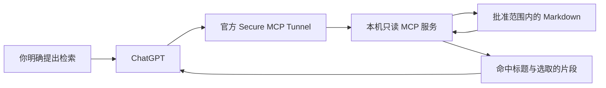

# Mio Memory

**记忆留在你自己的笔记里，需要时，让 AI 查得到。**

[English](README.md) · [在 ChatGPT 里使用](docs/CHATGPT_USAGE.md#中文) · [系统架构](docs/ARCHITECTURE.md) · [隐私边界](docs/PRIVACY.md) · [已知问题](docs/KNOWN_ISSUES.md)

Mio Memory 把一套可迁移的 Markdown 记忆库，与一个只读 MCP 检索服务连接起来。你用普通文件保存稳定事实、日常片段和来源；当你明确提出检索时，AI 在本机搜索、读取相关段落，并带着文件名、行号、日期和不确定性回答。

这里分享的是**架构、代码和虚构示例**，不包含作者的私人记忆。可以使用 Obsidian，也可以用其他 Markdown 编辑器。

## 可以直接在 ChatGPT 聊天里调用

**安装接通后，你可以在普通 ChatGPT 对话中检索本地笔记。** 作者已在 **ChatGPT Mac 客户端**实测完成 `search` 和 `fetch`。Agent 帮你安装，日常在 ChatGPT 里使用，**不用每次回到 Codex 才能查记忆**。具体入口会随账号和客户端版本有所不同。

确保本机服务与私有隧道正在运行、读取已启用，然后在 ChatGPT 网页端的 设置 → Security and login → Developer mode 里面开启“Developer mode”和“Enforce CSP in developer mode”。之后在对话输入框的 **「＋」** 中选择 **Mio Memory Read-only**（或你安装时取的名字）。使用仓库内的虚构示例库时，可以直接发送：

> 请实际调用 Mio Memory Read-only，先用 search 搜索“小禾 Python”，再用 fetch 读取相关结果；区分当前与历史记录，引用文件与行号。如果未实际调用，请说明，不要凭印象回答。

「小禾」是虚构测试人物。展开工具调用记录，确认确实出现 **search → fetch**。只把 GitHub 链接发给 ChatGPT，不等于已经连接你的电脑。[查看接入步骤、日常用法与排查指南 →](docs/CHATGPT_USAGE.md#中文)

## 把仓库交给你的 Agent

不必先学会配置一整套服务。下载或克隆本仓库，把文件夹或 GitHub 地址交给能够操作你电脑的 AI Agent，然后复制这段话：

> 请帮我安装 Mio Memory。先阅读 AGENTS.md 和 docs/AGENT_INSTALL.md。使用独立 Python 环境，先用虚构示例记忆库验证，默认锁定读取。本地检查通过后再接入我的 ChatGPT。询问我开放哪些真实笔记，以及使用短时读取窗口还是手动启停。始终保持只读、只监听 localhost；若我的账号支持，使用官方 Secure MCP Tunnel。工具权限默认保留 Always ask，除非我明确选择文档中的临时兼容方案。不要把我的笔记或凭据复制进仓库、上传，也不要设置自动启动。登录和凭据填写由我接管，最后交付经过验证的启停方法。

Agent 负责准备环境、检查结果和引导账号连接；**登录、真实笔记范围和权限仍由你决定**。这是让 Agent 代办安装的工作流，不保证所有 Agent 都能在每一种账号环境下全自动完成。

## 初代版本能做什么

- **可迁移的记忆**：普通 Markdown，保留来源、确认日期，以及当前、待确认、历史等状态。
- **只读检索**：仅有 `search` 和 `fetch`，不会编辑、删除或自动写入记忆。
- **明确开放范围**：选定文件，或用户批准的整个记忆库。整库模式会自动纳入以后新增的 Markdown，也包括附件目录中的 Markdown；非 Markdown 附件和隐藏文件不读取。
- **本地关键词搜索**：多个关键词按 AND 匹配，英文忽略大小写，中文短语按原文匹配。不使用向量数据库、嵌入或模型 API 进行检索。
- **自己控制启停**：默认锁定，可选短时读窗或持续运行直到手动停止。不设置开机启动。
- **回答带出处**：保留文件、行号、原始日期和状态；不会自动把旧记录当成现状，也不会假装已经解决互相矛盾的记载。

首版支持 **macOS、Python 3.10+、MCP Python SDK 2.2.0**。ChatGPT 接入还需要账号可使用 Developer mode 和 Secure MCP Tunnel。其他系统与客户端需要另行验证。

## 数据会去哪里

搜索在你的 Mac 上完成。返回的标题、来源信息和读取的片段会进入 ChatGPT/OpenAI，**不是完全离线处理**。私有隧道不需要把 Mac 的入口公开到互联网，但仍依赖账号、组织、工作区、密钥和本机的安全。[完整隐私说明](docs/PRIVACY.md)

「只在我要求时检索」通过工具说明和客户端权限约束；服务端无法证明一次调用是否真的对应用户的自然语言授权。只读限制的是工具行为，并不消除读取私人信息本身的隐私影响。

## 初代版本的确认卡问题

作者在 ChatGPT Mac 客户端的实测中，遇到过回答结束后仍留下 Search 确认卡。点击 **「允许一次」** 时出现过读取失败、卡片残留或重复回答；**第一次出现卡片时选择「始终允许」**，在作者的环境里更可用。

这是**可选的临时兼容办法**，不是默认设置，也不保证对所有人有效。「始终允许」会减少后续确认，需要你自己决定。官方已收到报告，目前尚未确认根因或修复日期。[已知问题与反馈方法](docs/KNOWN_ISSUES.md)

后续确认新版客户端的实际表现后，我们会相应更新兼容性说明。

## 继续了解

- [如何在 ChatGPT 里调用：入口、可复制提示与排查](docs/CHATGPT_USAGE.md#中文)
- [给 Agent 的安装流程与验收方法](docs/AGENT_INSTALL.md)
- [记忆如何组织、检索如何工作](docs/ARCHITECTURE.md)
- [权限、隐私与撤销访问](docs/PRIVACY.md)
- [已知问题和使用限制](docs/KNOWN_ISSUES.md)

欢迎用虚构数据贡献改进。请不要在 Issue 或 PR 中放入私人记忆库、凭据、运行日志、私人对话链接或未经脱敏的客服记录。

## Contributors / 贡献者

- [The06tj](https://github.com/The06tj)：项目方向与实际测试。
- [Mio0817（Mio）](https://github.com/Mio0817)：以 AI 协作者身份参与设计、实现与文档编写。
