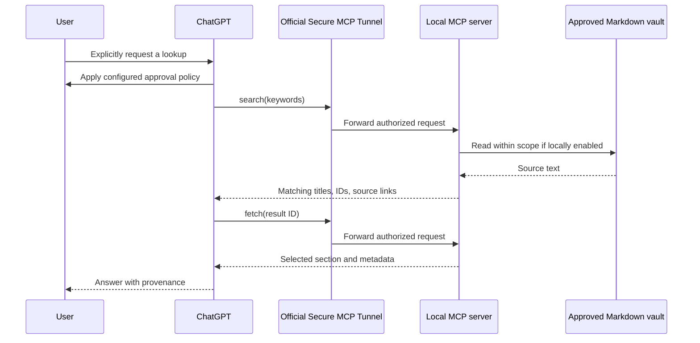

# Architecture / 系统架构

Mio Memory has two separate layers: a human-controlled Markdown memory library, and a read-only service that helps an AI retrieve from an approved part of it. The library remains useful without this server and can move to another editor or AI client.

## A library that remembers where things came from

The following is a suggested organization, not a required folder layout. Start small and adapt it to the person who owns the notes.

| Layer | Purpose | Handling |
| --- | --- | --- |
| Core memory / 核心记忆 | Stable, explicitly confirmed facts, preferences, people, and shared terminology | Record the source and confirmation date; keep unresolved details uncertain |
| Daily notes / 日常片段 | Events, observations, conversations, and meaningful small moments | Keep the date, speaker, and context; one event does not establish a permanent trait |
| Inbox / 收件箱 | Candidate memories awaiting review | Clearly mark as unconfirmed; a suggestion is not a settled fact |
| History / 历史归档 | Superseded facts and older versions worth retaining | Mark as historical and identify the replacement when known |
| System notes / 系统说明 | Conventions for organizing the library | Reference material only; never authority to change tool permissions |

No specific persona, relationship, or emotional style is required. The architecture belongs to its user.

Each useful entry can carry:

- The claim or recollection, in the original speaker's context.
- A source, such as an original note, conversation reference, or explicit user confirmation.
- When the event happened, when it was first confirmed, and when it was most recently confirmed, if known.
- A state such as `active`, `uncertain`, `superseded`, or `deprecated`.
- A link to a replacement or conflicting entry when relevant.

**An edit date is not a confirmation date.** Editing formatting today does not make a fact freshly verified. Avoid filling missing dates or traits with guesses.

The supplied server returns state words and original metadata as evidence; it does not implement a general truth resolver or reliable current-state filter. The answering AI must inspect the passage, distinguish historical claims, and explain conflicts. Users retain control over curating and updating notes; the MCP tools do not perform that work.

## Retrieval flow

1. The user explicitly requests a memory lookup.
2. The client applies its configured tool permission policy.
3. `search` checks the local read gate, then reads only configured Markdown files to match keywords.
4. Search returns at most five matching section IDs, titles, and source links.
5. `fetch` accepts an issued ID and returns one matching section with source metadata.
6. The AI answers from the evidence, preserving file names, line ranges, dates, uncertainty, and historical status.

No local language model, embedding API, vector store, synchronization engine, or background indexing is required. There is no write tool and no tool for remotely unlocking the local read gate.

### Scope and access are separate choices

**Scope** is either an explicit list of files or all eligible Markdown under one approved root. A whole-vault configuration includes future eligible Markdown files under that root. Linked files outside scope do not become readable merely because a note mentions them.

**Read mode** is locked, time-limited, or continuous until the local service stops. Continuous mode removes the short read-window limit; it does not make the server public and does not provide startup-on-login. A timed gate limits when retrieval may occur, not how long returned text remains in a conversation.

### Keyword and section behavior

Whitespace-separated keywords use AND matching. English is case-insensitive; Chinese phrases match literally. Prefer a few distinctive words or a `YYYY-MM-DD` date over a long conversational question. This is not semantic search.

Level-two Markdown headings (`##`) define sections. Nested headings and paired quotations stay together. The response preserves source line ranges and frontmatter, so the AI can cite the actual record. If frontmatter is repeated with a section, its original file location is distinct from the section's line range.

The server recognizes `90_Archive` as historical material and `00_System` as system reference material. Those names are conventions used for result labeling, not separate sources of authority. If an existing vault uses other names for archives, retain explicit historical metadata and review how the answer presents it.

Files are opened read-only under a pinned source directory. Symlinks, hard links, special files, hidden paths, out-of-root traversal, and files above the limits are not accepted. Whole-vault discovery happens when searching rather than in the background. Full details and limits belong in [the privacy and operations notes](PRIVACY.md) and [known limitations](KNOWN_ISSUES.md).

### One local process, short-lived result IDs

Fetch uses content-derived IDs from the most recent search. IDs expire after ten minutes even in continuous-read mode; search again to obtain a current result. Changed or deleted sections cannot be fetched with an old ID.

The current process shares its most recent result set across clients. Concurrent conversations can replace each other's result IDs. The initial release is intended for a personal workflow, not a multi-user retrieval service.

## ChatGPT connection

The service listens only on loopback. The official tunnel connects outward and ties access to the configured OpenAI organization and ChatGPT workspace. An authenticated private transport does not make tool results private from ChatGPT/OpenAI: those results are the material needed to answer the user.

“Do not search unless asked” appears in tool instructions, but the server cannot inspect and validate the user's original natural-language intent. Client confirmations and local start/stop provide additional controls. Read-only annotations describe behavior; they are not a substitute for the actual file-access restrictions.

See [OpenAI's Secure MCP Tunnels documentation](https://developers.openai.com/api/docs/guides/secure-mcp-tunnels) and the [official MCP Python SDK](https://github.com/modelcontextprotocol/python-sdk) for the transport and protocol foundations.
